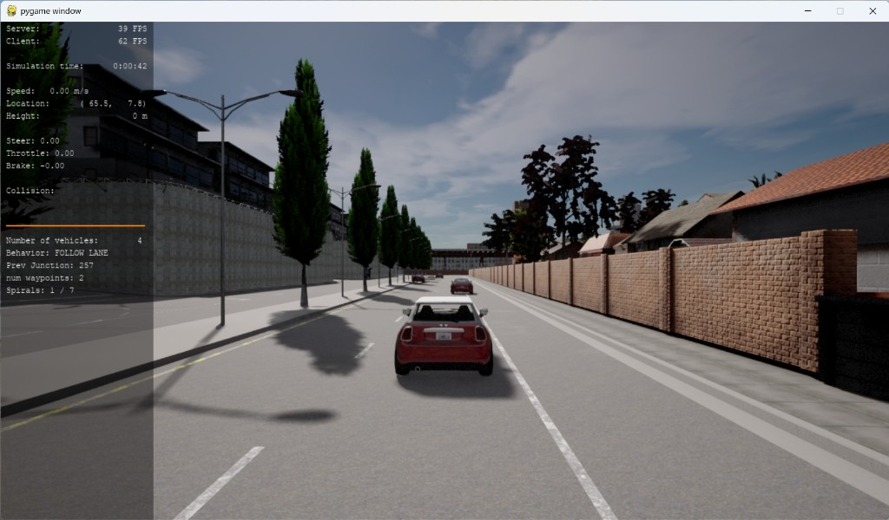
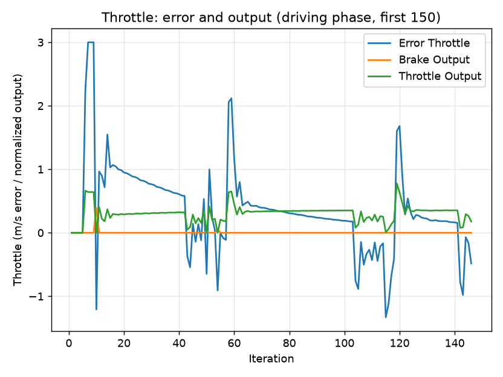
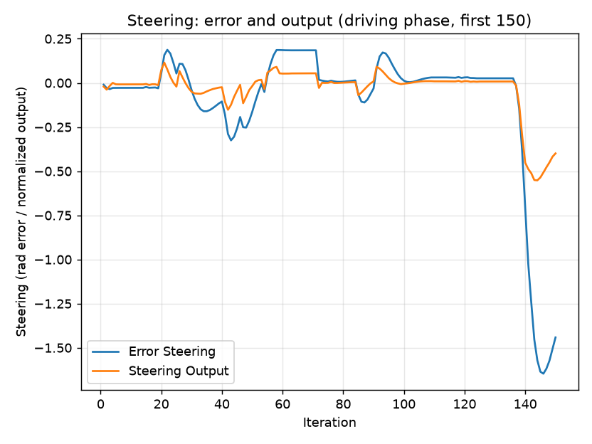
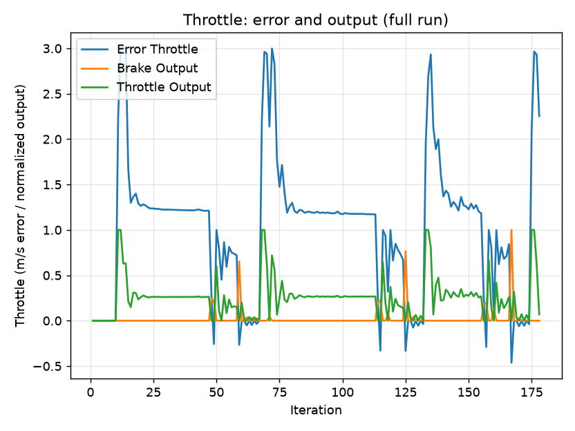
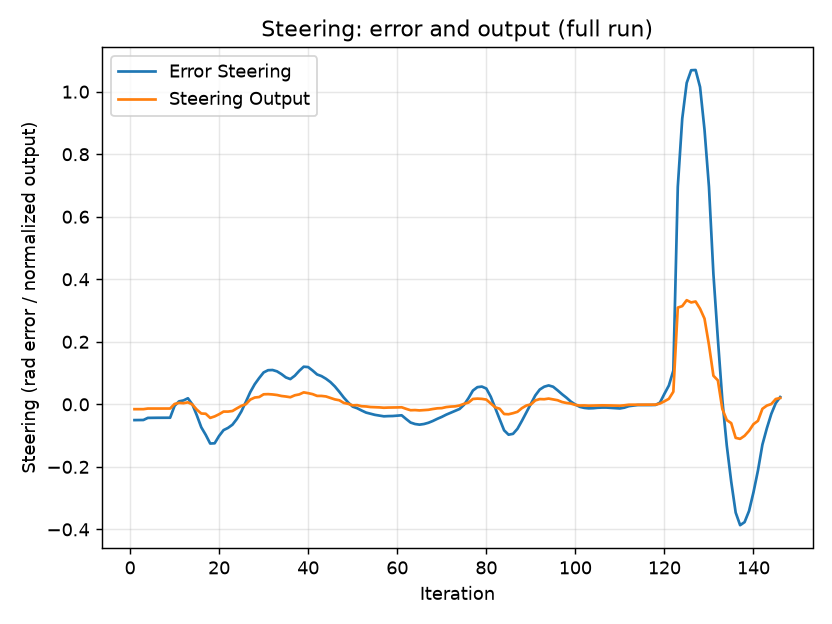

# PID Control — Trajectory Tracking Report

Project: Control and Trajectory Tracking for Autonomous Vehicles
Controller: two independent PID loops (steering and throttle) driving the
CARLA ego vehicle along the trajectory produced by the path planner.

---

## 1. Implementation summary

### Step 1 — PID object (`pid_controller.h` / `pid_controller.cpp`)
The `PID` class stores the three gains (`k_p`, `k_i`, `k_d`), the output
saturation limits, the running error terms (`error_p`, `error_i`, `error_d`),
and the update period `delta_t`.

- `init_controller` stores the gains and limits and precomputes integral
  clamp bounds for anti-windup.
- `update_error(cte)` updates the three error terms every cycle:
  - proportional: `error_p = cte`
  - derivative: `error_d = (cte - prev) / delta_t` (guarded when `delta_t == 0`)
  - integral: trapezoidal accumulation, then clamped to the anti-windup range.
- `total_error()` returns `k_p*error_p + k_i*error_i + k_d*error_d`, saturated
  to the configured output limits.
- `update_delta_time(dt)` stores the period used by the derivative/integral.

With no error signal fed in, `total_error()` is zero, so **the car does not
move** — the Step 1 acceptance check.



The screenshot above is the Step 1 verification, captured with all gains set to
zero so the controller commands nothing. The simulator HUD confirms the car is
stationary: **Speed 0.00 m/s, Steer 0.00, Throttle 0.00, Brake -0.00**, with no
collision recorded. The tuned gains listed below were restored immediately
afterwards.

### Step 2 — Throttle PID (`main.cpp`)
```
double target_speed = v_points.empty() ? 0.0 : v_points.back();
double error_throttle = target_speed - velocity;
```
**Why:** the last element of `v_points` is the speed the path planner wants the
car to reach along the current trajectory (its look-ahead target). The error is
that desired speed minus the measured `velocity`. Using the look-ahead target
(rather than the speed at the closest point) keeps the loop commanding forward
motion even if the local trajectory momentarily degenerates, which avoids a
zero-throttle deadlock. The PID output is split into throttle (positive) and
brake (negative) and constrained to `[-1, 1]`.

### Step 3 — Steering PID (`main.cpp`)
```
double desired_yaw = angle_between_points(x_position, y_position,
                                          x_points[idx_closest_point],
                                          y_points[idx_closest_point]);
double error_steer = normalize_angle(desired_yaw - yaw);
```
**Why:** the desired heading is the angle from the car's current position to the
nearest planned trajectory point. Subtracting the car's actual heading `yaw`
gives the heading error; `normalize_angle` keeps it in `[-PI, PI]` so the car
always turns the short way. Steering onto the closest trajectory point corrects
the cross-track error. The output is constrained to the allowed steering range.

### Gains used
| Loop     | Kp   | Ki     | Kd    | Output limits |
|----------|------|--------|-------|---------------|
| Steering | 0.30 | 0.0025 | 0.17  | [-0.60, 0.60] |
| Throttle | 0.21 | 0.0006 | 0.080 | [-1.0, 1.0]   |

---

## 2. Plots and what they show

Data logged to `steer_pid_data.txt` and `throttle_pid_data.txt`, plotted with
`plot_pid.py` (headless variant `plot_pid_save.py` saves PNGs). The logged run
is 926 iterations long; the driving-phase plots show the first 150, which covers
the whole of the tracked stretch plus the point where tracking is lost.

### Throttle, driving phase



**Throttle plot (driving phase).** The speed error (blue) jumps toward ~3 m/s
whenever the car is slower than the planned speed, and the throttle output
(green) rises in response (up to ~0.7); the brake output stays at or near 0
because the car is generally under target speed — braking is applied only
briefly and never exceeds about 0.18. When the car catches up, the error falls
and the throttle backs off. This is the expected proportional response of the
throttle loop tracking the planner's target speed.

### Steering, driving phase



**Steering plot (driving phase).** The steering error (blue) oscillates within
roughly ±0.2 rad as the car weaves onto the path, with a single excursion to
-0.33 rad near iteration 44 that recovers cleanly. The steering output (orange)
tracks the error at roughly 0.27 times its magnitude, which is the proportional
gain of 0.30 offset slightly by the accumulated integral term — so for most of
the run the output is a scaled copy of the error rather than a
derivative-damped version of it (see the note on update timing below).
Between iterations 138 and 144 the error plunges to
-1.53 rad: this is where the vehicle collides with road geometry at a sharp
bend, the trajectory collapses, and tracking is lost. The error then settles at
about -1.19 rad and stays there for the remainder of the run. Up to iteration
137 the controller holds a small, well-behaved error, i.e. it is tracking the
path.

### A note on the update period

`main.cpp` derives `delta_t` from `time()` and `difftime()`, which have
one-second resolution, while the control loop runs faster than 1 Hz. `delta_t`
is therefore 0.0 on most iterations, which makes `error_d` hit its zero guard
and freezes the integral accumulation.

The effect is measurable in the logged data. Across iterations 125 to 137 the
ratio of steering output to steering error is pinned at 0.267 — pure
proportional action, with a small constant offset from the integral term already
accumulated. At iteration 138 that ratio jumps to 0.99, which is a one-second
boundary rolling over and the derivative term contributing for a single cycle.

The derivative and integral terms are implemented correctly; they simply only
act on those one-second boundaries rather than every cycle. Sourcing `delta_t`
from a higher-resolution clock such as `std::chrono::steady_clock` lets both
terms act continuously. That change was implemented and tested; section 5
reports what it actually did.

### Full-run views





The full-run plots show the same data over all 926 iterations. Everything of
interest happens in the first 150; after tracking is lost the steering error
holds flat at about -1.19 rad and the throttle channel goes quiet, which is why
the driving-phase views above are the more informative pair.

---

## 3. Required questions

### (a) What is the effect of the PID according to the plots — how does each term affect the control command?
- **P (proportional):** produces a command proportional to the current error.
  It is the dominant term and is what drives the car back toward the target
  speed / heading. Increasing Kp makes the response faster/stronger but too
  much causes oscillation (visible as ringing around zero error).
- **I (integral):** accumulates past error and removes steady-state bias (e.g.
  a persistent small speed deficit or a constant heading offset). It acts
  slowly; too much Ki causes windup and slow oscillation, which is why we clamp
  the integral term (anti-windup). The same one-second timing applies here — the
  accumulator only advances on those boundaries.
- **D (derivative):** responds to the *rate of change* of the error and damps
  the response, suppressing overshoot when the error changes quickly. In this
  run its influence is intermittent rather than continuous: because `delta_t`
  comes from a one-second-resolution clock, the derivative term is zero on most
  iterations and contributes only when a whole second has elapsed. In the
  steering plot this shows up as the jump in the output-to-error ratio at
  iteration 138, not as continuous smoothing of the trace.

### (b) How would you design a way to automatically tune the PID parameters?
Several practical options:
- **Twiddle / coordinate ascent:** iteratively perturb each gain up/down, run a
  fixed evaluation, keep changes that reduce a cost (e.g. integral of squared
  cross-track and speed error), and shrink the step size until it converges.
- **Ziegler–Nichols:** raise Kp until sustained oscillation, measure the
  critical gain and period, then set Kp/Ki/Kd from the standard formulas.
- **Black-box optimizers:** grid/random search, Bayesian optimization, CMA-ES,
  or a genetic algorithm over the gains, evaluated on the same cost in
  simulation.
- **Online/adaptive:** gradient-descent on a running error metric while driving.
The key requirement is a repeatable scenario and a scalar cost that captures
tracking accuracy, control effort, and comfort (jerk).

### (c) PID is a model-free controller — pros and cons.
**Pros:**
- No vehicle model required; quick to implement and cheap to compute.
- Robust to modeling errors and works across many plants.
- Easy to understand and to tune by hand.

**Cons:**
- No look-ahead / no anticipation of the plant dynamics, so it reacts only
  after an error appears — poor on sharp maneuvers or at high speed.
- Gains are operating-point specific; a single set does not stay optimal across
  the whole speed/curvature envelope.
- No explicit constraint handling (actuator limits, comfort) beyond ad-hoc
  saturation and anti-windup.
- Coupled longitudinal/lateral behavior is not captured by two independent
  loops.

### (d) (Optional) What would you do to improve the controller?
- **Fix the update period, then re-tune.** Source `delta_t` from
  `std::chrono::steady_clock` rather than `time()`, so the derivative and
  integral terms act on every cycle instead of only on one-second boundaries
  (see section 2). This was implemented and tested; on its own it made the
  actuation harsher without improving tracking, so it has to be paired with a
  substantially smaller `Kd`. Section 5 reports the experiment in full.
- **Raise `Ki` on the throttle loop.** The measured 1.2 m/s steady-state speed
  deficit is a textbook integral-authority problem, and section 5 rules out the
  update timing as its cause.
- Replace/augment steering with a model-based law (**Stanley** or
  **pure-pursuit** with speed-dependent look-ahead) that anticipates curvature.
- **Gain scheduling** on speed and path curvature so the tuning stays valid
  across the envelope.
- Feed-forward terms (curvature feed-forward for steering, road-load
  feed-forward for throttle) so the PID only corrects residual error.
- Slow down before curves using the planned curvature to avoid understeer.
- Ultimately, an **MPC** that optimizes over a horizon subject to actuator and
  comfort constraints would handle sharp bends far better than PID.

---

## 4. Notes on the run
The logged run is 926 iterations long. The controller tracks the planned
trajectory well during the drivable stretch — iterations 1 to 137 — holding a
small steering error throughout.

It does not, however, reach the planner's target speed of ~3 m/s. The speed
error settles at about 1.19 m/s, which puts the car at roughly 1.8 m/s; the
simulator HUD reads 1.81 m/s during the run, confirming this independently. A
persistent offset of that kind is exactly what the integral term exists to
remove. The cause is the size of `Ki` rather than the update timing: at 0.0006,
the accumulator would have to reach into the hundreds before it contributed
enough throttle to close a 1.2 m/s gap, which is far longer than the run lasts.
This was checked experimentally rather than assumed — see section 5.

The run ends in a collision at a sharp bend where the *provided* motion planner's
trajectory takes the car into the road boundary; at that point the path
collapses ("No spirals generated") and tracking cannot recover. This is a
motion-planner/route limitation rather than a controller defect, and matches the
"a perfect trajectory is not expected" note in the project requirements.

---

## 5. Experiment: a higher-resolution update period

**Hypothesis.** Section 2 shows that `delta_t` is zero on most cycles, which
disables the derivative term and freezes the integral accumulator. If that is
what limits the controller, replacing the clock should improve tracking and
remove the steady-state speed error.

**Change.** `delta_t` was sourced from `std::chrono::steady_clock` instead of
`time()` / `difftime()`, giving a true fractional-second period of roughly 0.03 s
instead of 0 or 1. Gains were left unchanged so the timing was the only variable.

**What changed.** The derivative term became genuinely active. At iteration 140
the ratio of steering output to steering error rose from 0.30 to 0.64. Throttle
output reached full saturation at 1.0, where the baseline never exceeded 0.63
even at its hardest acceleration around iteration 136, and braking reached 0.77
against a baseline maximum below 0.2.

**What did not change.** The steady-state speed error was 1.17 m/s across
iterations 100–113, against 1.18 m/s in the baseline — unchanged. **The
hypothesis is therefore rejected for the speed deficit**, which is caused by the
small magnitude of `Ki` rather than by the update timing. The vehicle also left
the road at iteration 137, the same point as the baseline. Making the controller
substantially more responsive did not change where or why the run fails, which
supports the conclusion in section 4 that the failure originates in the planned
route rather than in the controller.

**Cost.** With `Kd` unchanged the actuation became far less smooth, alternating
between full throttle and heavy braking where the baseline had held a steady
throttle near 0.26 and had barely touched the brake at all. `Kd = 0.17` was
tuned while the derivative was effectively inactive, so restoring it scales that term by
roughly the ratio of the real period to one second. Adopting the change properly
would require re-tuning `Kd` downwards by about that factor.

**Outcome.** The higher-resolution clock is the correct implementation, but
untuned it degrades ride quality without improving tracking or preventing the
collision. It is therefore not part of the submitted build; it is retained on the
`chrono-timing-fix` branch. The comparison above is drawn from the first 150
iterations, which both runs cover.
